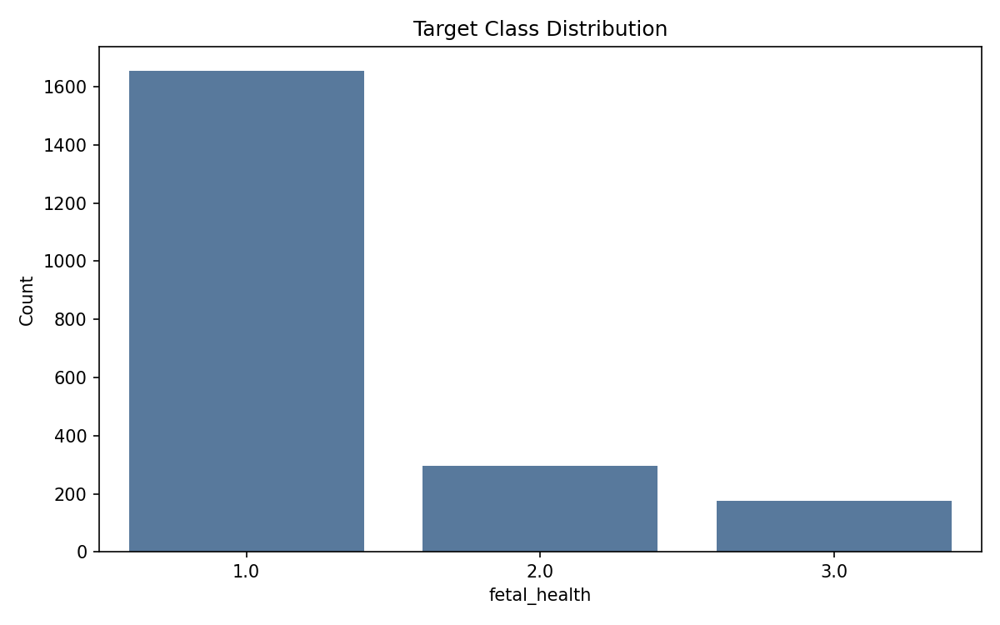
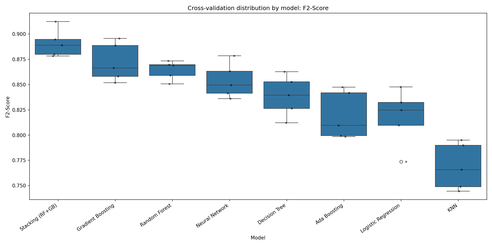
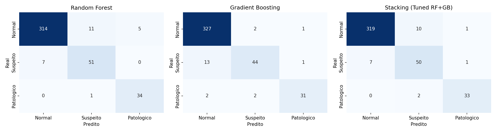
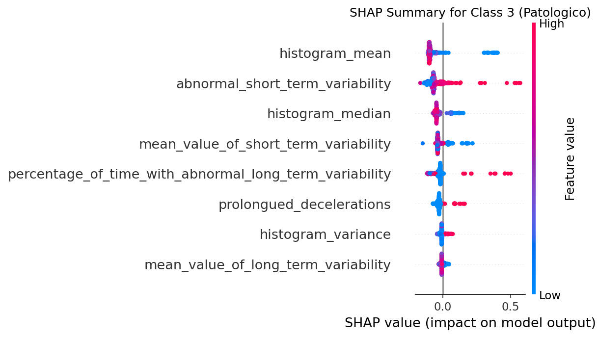

# Classificação de Saúde Fetal

Este projeto foi desenvolvido durante a disciplina eletiva de Aprendizado de Máquina na UFRGS. O objetivo é construir um modelo capaz de prever a saúde fetal com base em exames de cardiotocografia (CTG). Este README contém um resumo do trabalho realizado, uma descrição mais detalhada pode ser encontrada no [relatório](relatório.pdf)

## Conjunto de Dados

O repositório utiliza um conjunto de dados do Kaggle com 2.126 instâncias de exames de CTG. Os dados contêm 21 variáveis numéricas preditivas, que registram características como batimentos cardíacos fetais, número de acelerações e desacelerações.

A variável alvo classifica a saúde fetal em três categorias:
- Normal (1)
- Suspeito (2)
- Patológico (3)

O conjunto de dados apresenta um forte desbalanceamento, com a classe Normal concentra a grande maioria dos exemplos. O pré-processamento exigiu poucas alterações: os dados não tinham valores nulos, então o tratamento removeu apenas 13 linhas duplicadas e padronizou as variáveis numéricas com o `StandardScaler`. Além disso, como as variáveis preditivas eram todas numéricas (contínuas ou discretas), não foi necessário incluir nenhuma etapa de codificação. A etapa de análise exploratória identificou outliers, mas eles foram mantidos, pois valores extremos em métricas médicas ajudam a identificar os casos patológicos.

## Metodologia

A etapa de avaliação dividiu os dados em 80% para treinamento e 20% para teste, utilizando amostragem estratificada para preservar a proporção das classes.

O treinamento incluiu k-fold cross-validation com 5 folds e o projeto adotou o F2-Score Macro como métrica principal porque ele dá maior peso ao recall, penalizando os falsos negativos. No contexto médico, falhar em identificar um feto patológico causa mais dano do que gerar um falso-positivo.

Para evitar vazamento de dados, pipelines do scikit-learn encapsularam a etapa de padronização. Isso garantiu que o scaler utilizasse apenas os dados de treinamento de cada partição, preservando o isolamento dos conjuntos de validação e teste.

## Spot-checking de Algoritmos

A fase inicial testou oito algoritmos com configurações simples: KNN, Árvore de Decisão, Random Forest, Gradient Boosting, AdaBoost, Stacking (RF+GB), Regressão Logística e Redes Neurais (MLP).

Os métodos de ensemble baseados em árvores (Random Forest  Gradient Boosting) alcançaram o melhor desempenho. Eles mostraram estabilidade preditiva e pouca variação entre os folds da validação cruzada, superando modelos lineares e baseados em instâncias.

## Otimização de Hiperparâmetros e Resultados Finais

Após a seleção inicial, o processo otimizou os hiperparâmetros do Random Forest e do Gradient Boosting através de uma busca aleatória ampla seguida de uma busca em grade. O projeto também avaliou um classificador de Stacking combinando as previsões desses dois modelos ajustados.

Na avaliação final no conjunto de teste isolado, o Random Forest atingiu a melhor pontuação, com um F2-Score Macro de 0.9236. Ele identificou corretamente 34 das 35 instâncias patológicas do teste. Os erros do modelo ficaram concentrados na distinção entre fetos Normais e Suspeitos.

O Random Forest finalizou o pipeline como o modelo escolhido. Ele superou o Stacking no teste e possui uma estrutura mais simples de interpretar.

## Interpretabilidade do Modelo

O script de interpretabilidade gerou valores SHAP e calculou a permutation importance para entender como o Random Forest toma suas decisões.

A análise indicou que a variabilidade de curto prazo da frequência cardíaca e as medidas de tendência central do histograma (como `histogram_mean` e `abnormal_short_term_variability`) dominam a classificação dos casos patológicos. Esses resultados concordam com a prática clínica, já que alterações na variabilidade dos batimentos apontam para problemas da saúde do feto.

